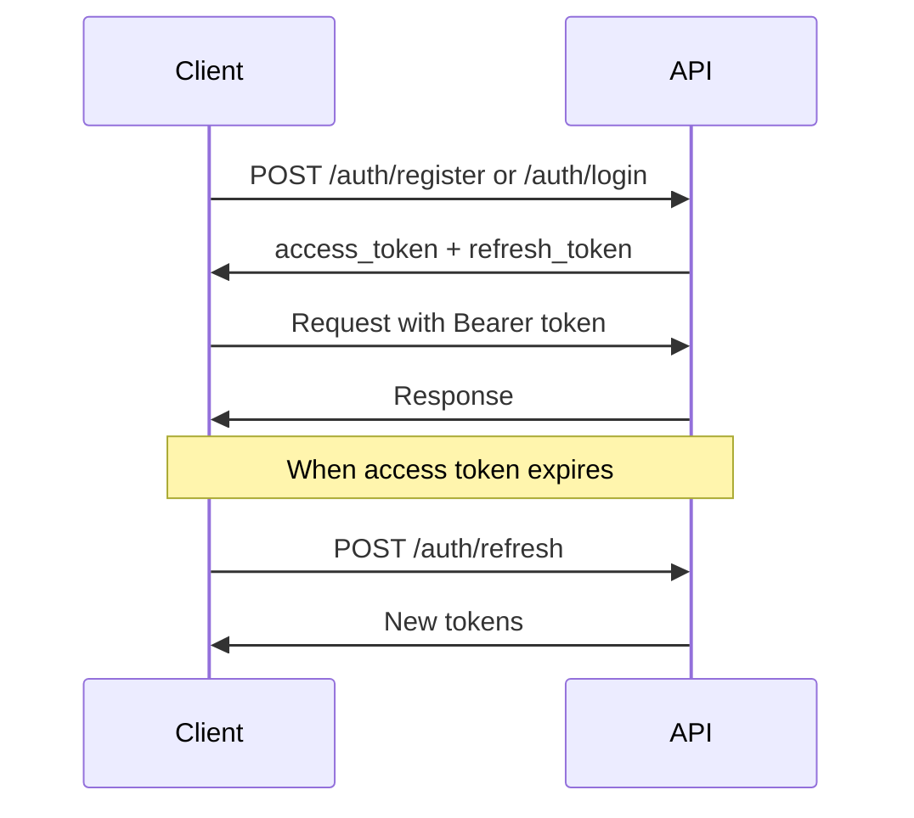

# Zinzino IoT API Documentation

Complete API reference for the Zinzino IoT Backend service.

## Base URL

```
Development: http://localhost:8080/api/v1
Production: https://api.zinzino-iot.com/api/v1
```

## Authentication

Most endpoints require authentication using JWT Bearer tokens.

### Authentication Flow



### Headers

```http
Authorization: Bearer <access_token>
Content-Type: application/json
```

## Rate Limiting

- **Authentication endpoints**: 10 requests/minute
- **General endpoints**: 100 requests/minute
- **Sync endpoints**: 20 requests/minute

Rate limit headers in response:
```http
X-RateLimit-Limit: 100
X-RateLimit-Remaining: 95
X-RateLimit-Reset: 1640000000
```

## Error Handling

### Error Response Format

```json
{
  "detail": "Error message description",
  "error_code": "ERROR_CODE",
  "timestamp": "2024-12-16T19:00:00Z"
}
```

### HTTP Status Codes

| Code | Meaning | Description |
|------|---------|-------------|
| 200 | OK | Request successful |
| 201 | Created | Resource created |
| 204 | No Content | Successful deletion |
| 400 | Bad Request | Invalid request data |
| 401 | Unauthorized | Missing or invalid token |
| 403 | Forbidden | Insufficient permissions |
| 404 | Not Found | Resource not found |
| 409 | Conflict | Resource conflict (duplicate) |
| 422 | Validation Error | Pydantic validation failed |
| 429 | Too Many Requests | Rate limit exceeded |
| 500 | Internal Server Error | Server error |

## Pagination

List endpoints support pagination:

```http
GET /api/v1/notifications?limit=50&offset=0
```

**Parameters:**
- `limit`: Number of items per page (default: 50, max: 100)
- `offset`: Number of items to skip (default: 0)

**Response:**
```json
{
  "items": [...],
  "total": 150,
  "limit": 50,
  "offset": 0
}
```

## Filtering & Sorting

### Filtering

```http
GET /api/v1/devices?type=fish_oil&is_active=true
GET /api/v1/notifications?is_read=false&type=reminder
```

### Sorting

```http
GET /api/v1/devices?sort=created_at&order=desc
GET /api/v1/devices?sort=name&order=asc
```

---

# API Endpoints

## 🔐 Authentication

### Register User

Create a new user account.

```http
POST /api/v1/auth/register
```

**Request Body:**
```json
{
  "email": "user@example.com",
  "password": "SecurePass123!",
  "full_name": "John Doe",
  "phone": "+905551234567",
  "language": "en",
  "timezone": "Europe/Istanbul"
}
```

**Response:** `201 Created`
```json
{
  "access_token": "eyJhbGciOiJIUzI1NiIsInR5cCI6IkpXVCJ9...",
  "refresh_token": "eyJhbGciOiJIUzI1NiIsInR5cCI6IkpXVCJ9...",
  "token_type": "bearer",
  "expires_in": 86400,
  "user": {
    "user_id": "uuid",
    "email": "user@example.com",
    "full_name": "John Doe",
    "language": "en",
    "timezone": "Europe/Istanbul",
    "created_at": "2024-12-16T19:00:00Z"
  }
}
```

**Password Requirements:**
- Minimum 8 characters
- At least one letter
- At least one number

---

### Login

Authenticate user with email and password.

```http
POST /api/v1/auth/login
```

**Request Body:**
```json
{
  "email": "user@example.com",
  "password": "SecurePass123!"
}
```

**Response:** `200 OK`
```json
{
  "access_token": "eyJhbGciOiJIUzI1NiIsInR5cCI6IkpXVCJ9...",
  "refresh_token": "eyJhbGciOiJIUzI1NiIsInR5cCI6IkpXVCJ9...",
  "token_type": "bearer",
  "expires_in": 86400,
  "user": {
    "user_id": "uuid",
    "email": "user@example.com",
    "full_name": "John Doe"
  }
}
```

---

### Google OAuth

Authenticate with Google account.

```http
POST /api/v1/auth/google
```

**Request Body:**
```json
{
  "id_token": "google_id_token_here",
  "full_name": "John Doe",
  "profile_picture": "https://example.com/photo.jpg"
}
```

**Response:** `200 OK` (Same as login)

---

### Refresh Token

Get new access token using refresh token.

```http
POST /api/v1/auth/refresh
```

**Request Body:**
```json
{
  "refresh_token": "eyJhbGciOiJIUzI1NiIsInR5cCI6IkpXVCJ9..."
}
```

**Response:** `200 OK`
```json
{
  "access_token": "new_access_token",
  "refresh_token": "new_refresh_token",
  "token_type": "bearer",
  "expires_in": 86400
}
```

---

### Logout

Revoke all refresh tokens for the user.

```http
POST /api/v1/auth/logout
```

**Headers:** `Authorization: Bearer <token>`

**Response:** `200 OK`
```json
{
  "message": "Logged out successfully"
}
```

---

## 📱 Devices

### List Devices

Get all devices for the authenticated user.

```http
GET /api/v1/devices
```

**Headers:** `Authorization: Bearer <token>`

**Query Parameters:**
- `include_inactive` (boolean): Include inactive devices (default: false)
- `sort` (string): Sort field (name, created_at, type)
- `order` (string): Sort order (asc, desc)

**Response:** `200 OK`
```json
[
  {
    "device_id": "uuid",
    "device_name": "My Fish Oil Dispenser",
    "device_type": "fish_oil",
    "mac_address": "AA:BB:CC:DD:EE:FF",
    "serial_number": "ZNZ-2024-0001",
    "location": "Kitchen",
    "firmware_version": "1.0.0",
    "battery_level": 85,
    "supplement_level": 70,
    "is_connected": true,
    "is_active": true,
    "last_seen": "2024-12-16T18:55:00Z",
    "created_at": "2024-12-01T10:00:00Z",
    "updated_at": "2024-12-16T18:55:00Z"
  }
]
```

**Device Types:**
- `fish_oil` - Fish Oil Dispenser
- `vitamin_d` - Vitamin D Dispenser
- `krill_oil` - Krill Oil Dispenser
- `vegan` - Vegan Supplement Dispenser

---

### Create Device

Register a new IoT device.

```http
POST /api/v1/devices
```

**Headers:** `Authorization: Bearer <token>`

**Request Body:**
```json
{
  "device_name": "My Fish Oil Dispenser",
  "device_type": "fish_oil",
  "mac_address": "AA:BB:CC:DD:EE:FF",
  "serial_number": "ZNZ-2024-0001",
  "location": "Kitchen",
  "firmware_version": "1.0.0"
}
```

**Response:** `201 Created`
```json
{
  "device_id": "uuid",
  "device_name": "My Fish Oil Dispenser",
  "device_type": "fish_oil",
  ...
}
```

---

### Get Device

Get details of a specific device.

```http
GET /api/v1/devices/{device_id}
```

**Headers:** `Authorization: Bearer <token>`

**Response:** `200 OK` (Device object)

---

### Update Device

Update device information.

```http
PUT /api/v1/devices/{device_id}
```

**Headers:** `Authorization: Bearer <token>`

**Request Body:**
```json
{
  "device_name": "Updated Name",
  "location": "Living Room",
  "battery_level": 90,
  "supplement_level": 80,
  "is_active": true
}
```

All fields are optional (partial update supported).

**Response:** `200 OK` (Updated device object)

---

### Delete Device

Soft-delete a device (deactivates it).

```http
DELETE /api/v1/devices/{device_id}
```

**Headers:** `Authorization: Bearer <token>`

**Response:** `204 No Content`

---

### Get Device History

Get activity history for a device.

```http
GET /api/v1/devices/{device_id}/history
```

**Headers:** `Authorization: Bearer <token>`

**Query Parameters:**
- `start_date` (datetime): Start date filter
- `end_date` (datetime): End date filter
- `limit` (int): Max records (default: 50, max: 200)
- `offset` (int): Pagination offset

**Response:** `200 OK`
```json
{
  "activities": [
    {
      "activity_id": "uuid",
      "action_type": "dispense",
      "dosage_ml": 5.0,
      "timestamp": "2024-12-16T09:00:00Z",
      "metadata": {
        "supplement_type": "fish_oil",
        "scheduled": true
      }
    }
  ],
  "total": 150
}
```

---

## 🔔 Notifications

### List Notifications

Get user notifications with filtering.

```http
GET /api/v1/notifications
```

**Headers:** `Authorization: Bearer <token>`

**Query Parameters:**
- `is_read` (boolean): Filter by read status
- `type` (string): Filter by type (reminder, low_battery, low_supplement, achievement)
- `device_id` (uuid): Filter by device
- `limit` (int): Max results (default: 50, max: 100)
- `offset` (int): Pagination offset

**Response:** `200 OK`
```json
{
  "notifications": [
    {
      "notification_id": "uuid",
      "type": "reminder",
      "title": "Time to take your supplement!",
      "message": "Don't forget your daily fish oil dose",
      "device_id": "uuid",
      "is_read": false,
      "created_at": "2024-12-16T09:00:00Z",
      "read_at": null,
      "metadata": {
        "scheduled_time": "09:00"
      }
    }
  ],
  "total": 25
}
```

**Notification Types:**
- `reminder` - Scheduled reminder
- `low_battery` - Low battery alert
- `low_supplement` - Low supplement level
- `achievement` - Achievement unlocked

---

### Create Notification

Create a new notification (mainly for testing).

```http
POST /api/v1/notifications
```

**Headers:** `Authorization: Bearer <token>`

**Request Body:**
```json
{
  "type": "reminder",
  "title": "Notification Title",
  "message": "Notification message",
  "device_id": "uuid",
  "metadata": {}
}
```

**Response:** `201 Created` (Notification object)

---

### Mark Notification as Read

Mark a specific notification as read.

```http
PUT /api/v1/notifications/{notification_id}/read
```

**Headers:** `Authorization: Bearer <token>`

**Response:** `200 OK`
```json
{
  "notification_id": "uuid",
  "is_read": true,
  "read_at": "2024-12-16T19:00:00Z",
  ...
}
```

---

### Mark All as Read

Mark all user notifications as read.

```http
POST /api/v1/notifications/mark-all-read
```

**Headers:** `Authorization: Bearer <token>`

**Response:** `200 OK`
```json
{
  "marked_count": 15
}
```

---

### Get Notification Statistics

Get notification statistics.

```http
GET /api/v1/notifications/stats
```

**Headers:** `Authorization: Bearer <token>`

**Response:** `200 OK`
```json
{
  "total_count": 50,
  "unread_count": 15,
  "by_type": {
    "reminder": 30,
    "low_battery": 10,
    "low_supplement": 5,
    "achievement": 5
  }
}
```

---

### Delete Notification

Delete a notification.

```http
DELETE /api/v1/notifications/{notification_id}
```

**Headers:** `Authorization: Bearer <token>`

**Response:** `200 OK`
```json
{
  "success": true,
  "notification_id": "uuid"
}
```

---

## 🔄 Synchronization

### Full Sync

Perform full data synchronization.

```http
POST /api/v1/sync/full
```

**Headers:** `Authorization: Bearer <token>`

**Request Body:**
```json
{
  "device_info": {
    "platform": "ios",
    "app_version": "1.0.0",
    "os_version": "17.0",
    "device_model": "iPhone 15"
  },
  "include_deleted": false
}
```

**Response:** `200 OK`
```json
{
  "sync_id": "uuid",
  "sync_timestamp": "2024-12-16T19:00:00Z",
  "sync_status": "success",
  "devices": [...],
  "notifications": [...],
  "activity_logs": [...],
  "notification_settings": {...},
  "user_profile": {...}
}
```

**When to use Full Sync:**
- App first launch
- Last full sync > 7 days ago
- After delta sync conflicts
- User explicitly requests refresh

---

### Delta Sync

Perform incremental synchronization.

```http
POST /api/v1/sync/delta
```

**Headers:** `Authorization: Bearer <token>`

**Request Body:**
```json
{
  "device_info": {
    "platform": "ios",
    "app_version": "1.0.0",
    "os_version": "17.0",
    "device_model": "iPhone 15"
  },
  "last_sync_timestamp": "2024-12-16T18:00:00Z",
  "client_changes": {
    "devices_modified": [],
    "notifications_read": ["uuid1", "uuid2"]
  }
}
```

**Response:** `200 OK`
```json
{
  "sync_id": "uuid",
  "sync_timestamp": "2024-12-16T19:00:00Z",
  "sync_status": "success",
  "devices_updated": [...],
  "devices_deleted": ["uuid"],
  "notifications_new": [...],
  "notifications_updated": [...],
  "activity_logs_new": [...],
  "conflicts": []
}
```

**When to use Delta Sync:**
- Regular background syncs
- Periodic updates (every 5-15 minutes)
- After user actions
- Efficient bandwidth usage

---

### Get Sync Status

Check synchronization status.

```http
GET /api/v1/sync/status
```

**Headers:** `Authorization: Bearer <token>`

**Response:** `200 OK`
```json
{
  "last_full_sync": "2024-12-15T10:00:00Z",
  "last_delta_sync": "2024-12-16T18:55:00Z",
  "last_sync_status": "success",
  "recommend_full_sync": false,
  "pending_changes": 0
}
```

---

## 📊 Best Practices

### Sync Strategy

1. **Initial App Launch**: Use full sync
2. **Background Sync**: Use delta sync every 5-15 minutes
3. **User Pull-to-Refresh**: Use delta sync
4. **After 7 days**: Use full sync
5. **On Conflicts**: Fallback to full sync

### Error Handling

```javascript
try {
  const response = await fetch('/api/v1/devices');
  if (!response.ok) {
    const error = await response.json();
    console.error(error.detail);
  }
} catch (error) {
  console.error('Network error:', error);
}
```

### Token Refresh

Implement automatic token refresh:

```javascript
async function refreshToken() {
  const response = await fetch('/api/v1/auth/refresh', {
    method: 'POST',
    body: JSON.stringify({ refresh_token: storedRefreshToken })
  });
  const data = await response.json();
  saveTokens(data.access_token, data.refresh_token);
}
```

### Pagination

```javascript
async function getAllDevices() {
  let allDevices = [];
  let offset = 0;
  const limit = 50;
  
  while (true) {
    const response = await fetch(
      `/api/v1/devices?limit=${limit}&offset=${offset}`
    );
    const data = await response.json();
    allDevices = allDevices.concat(data.items);
    
    if (data.items.length < limit) break;
    offset += limit;
  }
  
  return allDevices;
}
```

---

## 🔍 Examples

See [`examples/api_usage.py`](examples/api_usage.py) for complete Python examples.

See [`examples/postman_collection.json`](examples/postman_collection.json) for Postman collection.

---

**API Version**: 1.0.0  
**Last Updated**: December 2024  
**Base URL**: `/api/v1`
