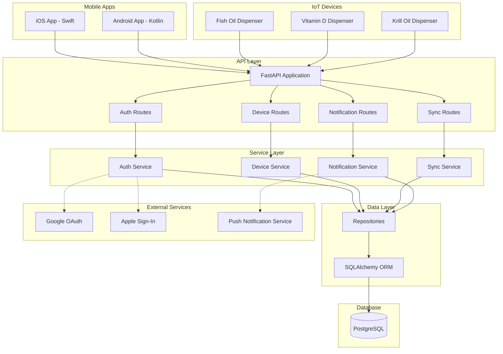
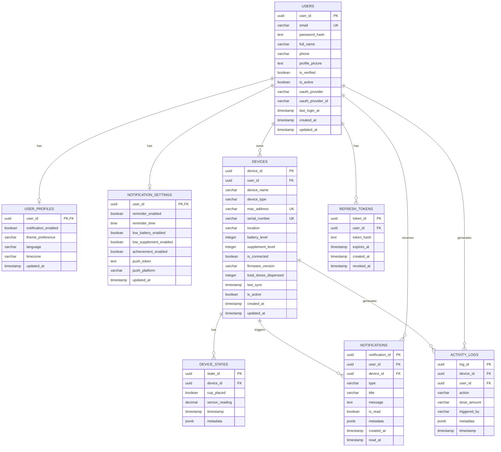
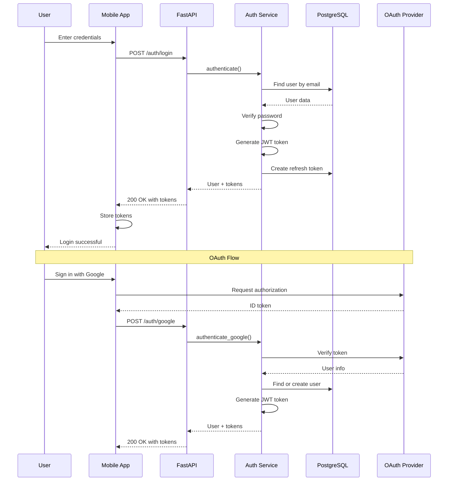
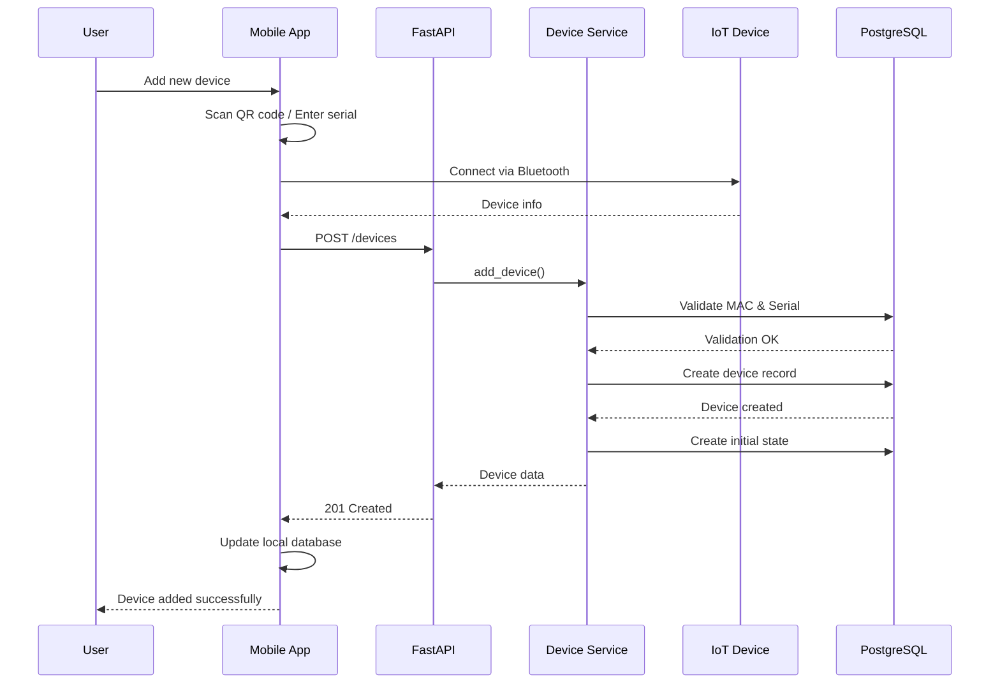
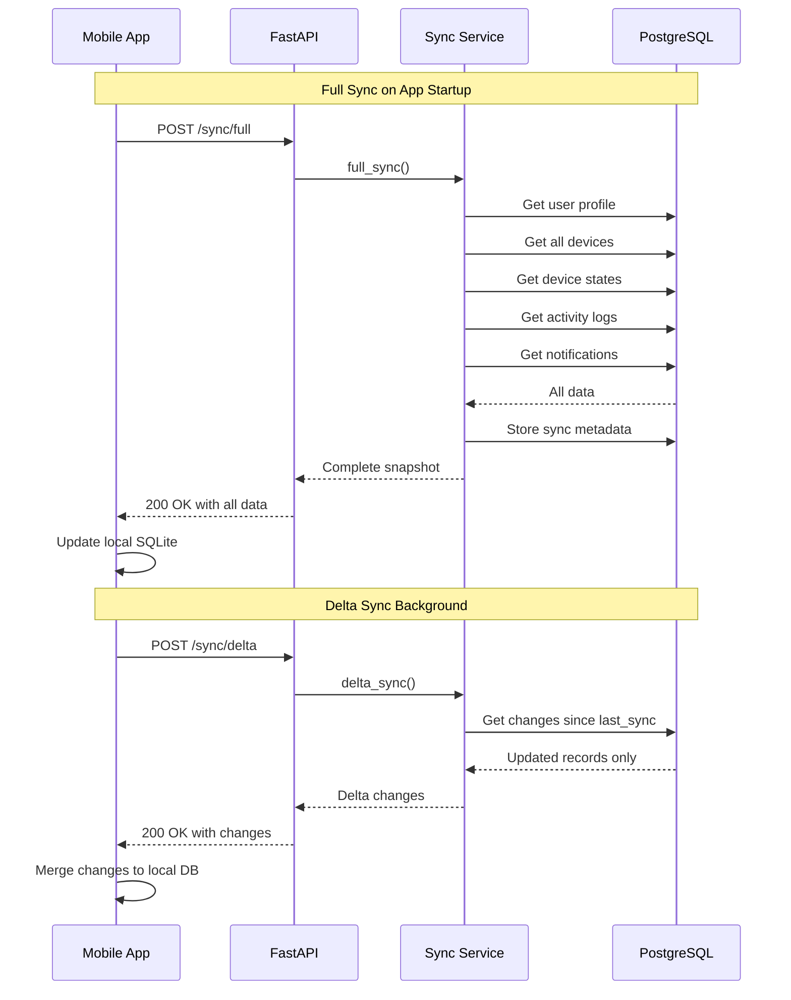
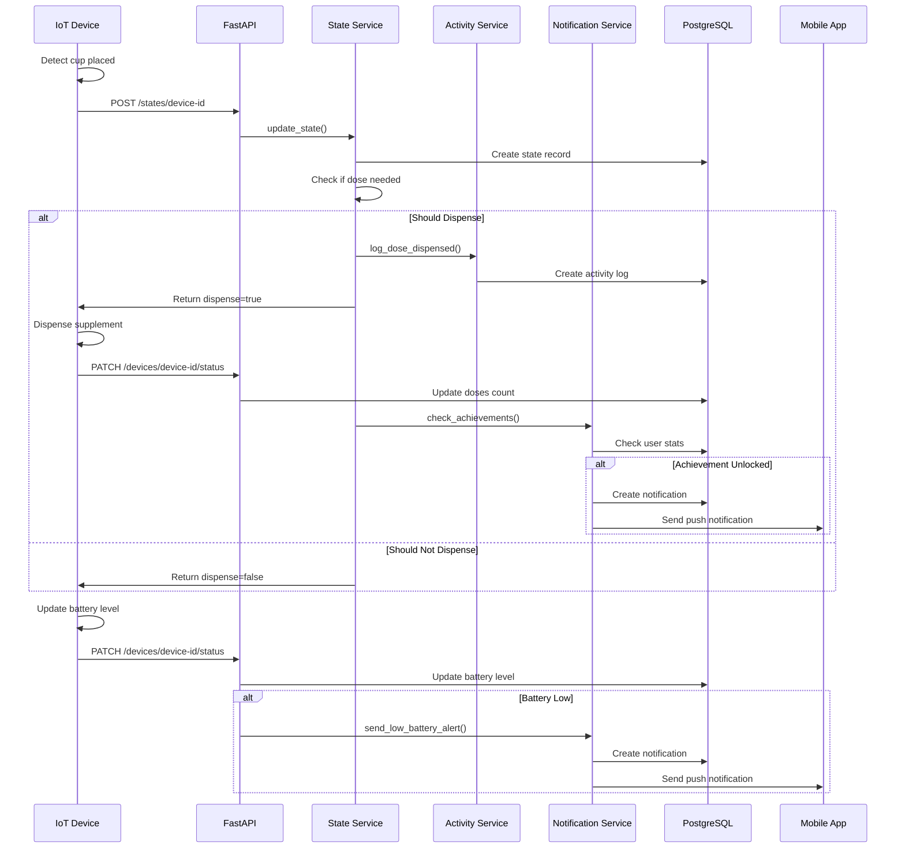
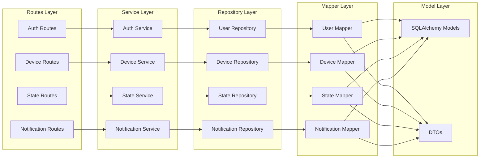
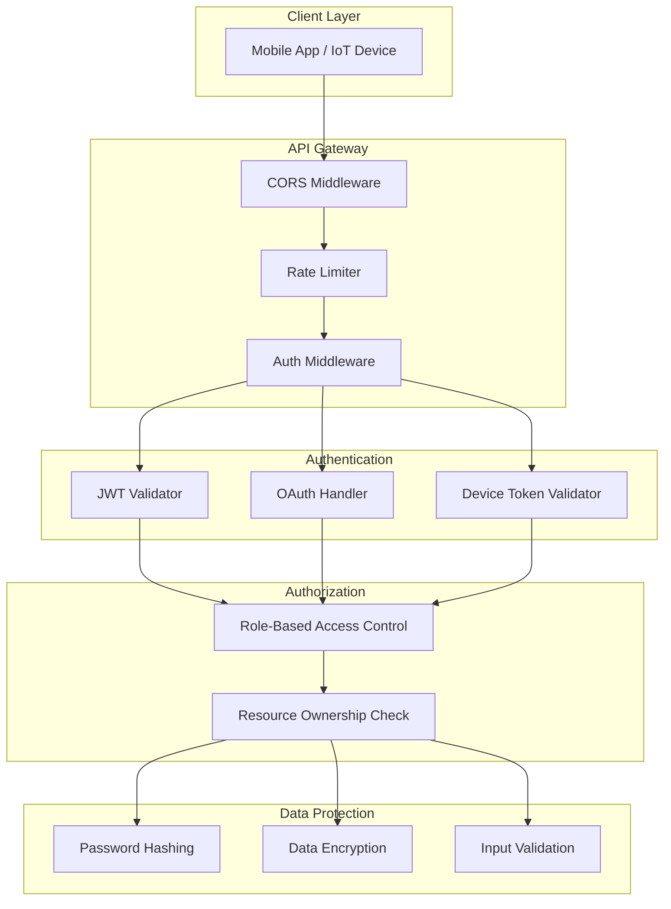
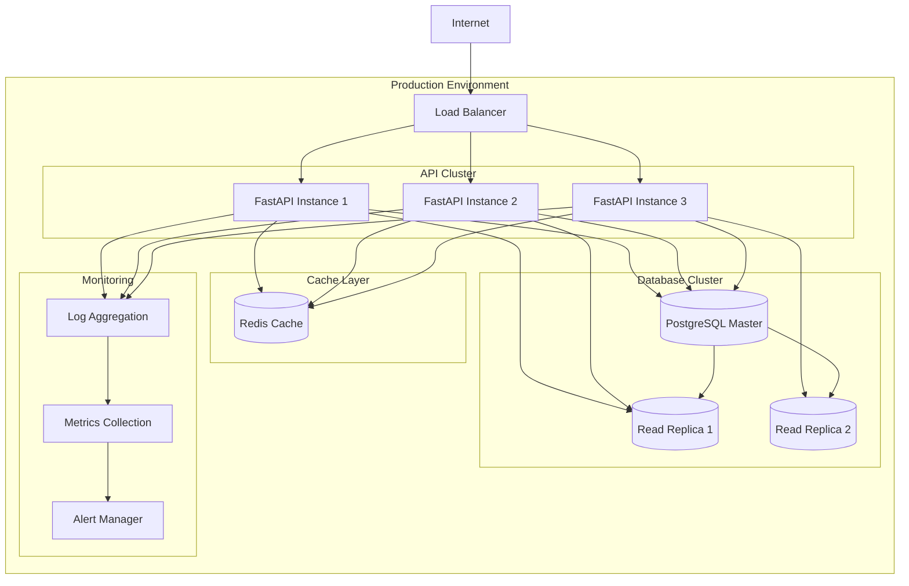

# Zinzino IoT Backend API - System Diagrams

## 📊 System Architecture Overview

## 🗄️ Database Schema Diagram

## 🔄 Authentication Flow

## 📱 Device Registration Flow

## 🔄 Synchronization Flow

## 🤖 IoT Device State Update Flow

## 📊 Data Layer Architecture

## 🔐 Security Architecture

## 📈 Deployment Architecture

---

**Document Version:** 1.0  
**Last Updated:** 2025-12-16  
**Purpose:** Visual representation of Zinzino IoT Backend API architecture
